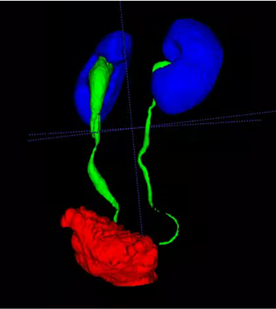

# UreterSeg
UreterSeg: The First Large-Scale Dataset for Challenging Ureter Segmentation -Filling the Gap in Abdominal Organ Segmentation.

This repo provides the codebase and dataset of work UreterSeg: Filling the Gap in Abdominal Organ Segmentation - The First Large-Scale Dataset for Challenging Ureter Segmentation from nc-CT and CTU images 

# DataSet and Models
Please contact Jun (linkwj AT shsmu DOT edu DOT cn) for the dataset. Using your affiliation email to get the unzip password/BaiduPan access code. The email should contain the following information:
Name/Homepage/Google Scholar: (Tell us who you are.)
Primary Affiliation: (The name of your institution or university, etc.)
Job Title: (E.g., Professor, Associate Professor, Ph.D., etc.)
Affiliation Email: (the password will be sent to this email, we just reply to the email which is the end of "edu".)
How to use: (Only for academic research, not for commercial use or second-development.)

# Acknowledgment
This dataset belongs to the Shanghai General Hospital and is licensed under the  Apache-2.0 license.
This project has been approved by the institutional ethical review committee. We thank all collaborators for the data collection and annotation!
This project and dataset were designed for academic research, not for clinical, commercial, second-development, or other use. 

